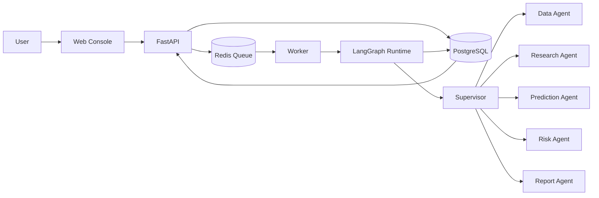

# FinAgent Platform

<p align="center">
  <strong>An explainable, traceable multi-agent platform for financial research.</strong>
</p>

<p align="center">
  <a href="./README.md">English</a> | <a href="./README.zh-CN.md">中文</a>
</p>

<p align="center">
  <a href="https://github.com/Ashleyzm/financial-agent-platform/actions/workflows/ci.yml"></a>
  
  
  
  
  
</p>

FinAgent Platform turns a stock research question into an asynchronous, auditable workflow. A supervisor coordinates specialist agents for market data, research, prediction, risk, and reporting. The LLM is used as a reasoning and explanation layer; structured models and tools remain responsible for data and prediction.

> [!IMPORTANT]
> This project is intended for research and education. Its output is not investment advice.

## Why this project

- **Explainable by design** — every task exposes agent steps, evidence, model usage, errors, and trace IDs.
- **Provider-independent** — switch between deterministic mocks, AkShare market data, and OpenAI-compatible LLM providers.
- **Asynchronous and persistent** — FastAPI, Redis, Worker, LangGraph, and PostgreSQL form a complete task pipeline.
- **Student-friendly** — the entire demo starts with Docker Compose and works without paid API keys.
- **Production-aware** — health checks, migrations, structured errors, CI, and a public-server deployment profile are included.

## Architecture



```text
Web -> FastAPI -> PostgreSQL / Redis -> Worker -> LangGraph -> Forecast Report
```

## Current capabilities

| Area | Status | Description |
|---|---|---|
| Task API | Ready | Create, list, inspect, cancel, and trace research tasks |
| Async runtime | Ready | Redis queue and independent Worker execution |
| Multi-agent workflow | Ready | Six-node LangGraph workflow with persisted progress |
| Market data | Ready | Deterministic mock and AkShare provider modes |
| LLM integration | Ready | Mock and OpenAI-compatible provider modes |
| Web console | Ready | Task submission, polling, timeline, report, and failure states |
| Prediction model | Prototype | Rule-based baseline; ML/time-series model is planned |
| News and filings RAG | Planned | Retrieval, citations, and source management |

## Quick start

### Requirements

- Git
- Docker Desktop with Docker Compose
- Python 3.12+ only when running tests locally

### Run the complete platform

```powershell
Copy-Item .env.example .env
docker compose up -d --build --wait
```

Open:

- Web console: <http://localhost:3000>
- API health: <http://localhost:8000/health>
- API documentation: <http://localhost:8000/docs>

Create a stock research task in the Web console. The Worker will consume it automatically and the page will update until the report is ready.

The development profile binds all published ports to `127.0.0.1`; it is not reachable from other computers by default.

Stop the platform:

```powershell
docker compose down
```

## Provider configuration

The default configuration is deterministic and requires no external key:

```env
MARKET_DATA_PROVIDER=mock
LLM_PROVIDER=mock
```

To enable real market data, set `MARKET_DATA_PROVIDER=akshare`. To use an OpenAI-compatible model endpoint, configure `LLM_PROVIDER=openai-compatible`, `LLM_API_KEY`, `LLM_BASE_URL`, and `LLM_MODEL` in `.env`.

Never commit `.env` or production secrets.

## Public deployment

`localhost` is visible only on the current computer. To provide a stable link for teammates or reviewers, deploy the full stack to a Linux server with a public IP:

```bash
cp .env.production.example .env.production
# Replace every CHANGE_ME value before continuing.
docker compose --env-file .env.production -f compose.prod.yaml up -d --build --wait
```

The production profile exposes only the Web gateway. PostgreSQL, Redis, API, and Worker remain on the private Docker network. See [Public deployment guide](docs/public-deployment.md) for server, firewall, domain, HTTPS, and security instructions.

## Repository layout

```text
apps/web/                   Web console and Nginx gateway
services/api/               FastAPI application
services/worker/            Asynchronous task worker
packages/contracts/         Shared API and workflow contracts
packages/agent_runtime/     LangGraph workflow and agent tools
packages/model_provider/    LLM provider abstraction
packages/financial_data/    Financial data providers
packages/task_store/        PostgreSQL and Redis persistence
infra/                      Database migrations and infrastructure
tests/                      Unit and end-to-end tests
docs/                       Product, architecture, and deployment docs
```

## Development checks

```powershell
python -m pip install -e ".[dev]"
ruff check .
ruff format --check .
pytest -q
python tests/e2e_smoke.py
```

Every pull request runs code-quality checks and a fresh Docker end-to-end workflow in GitHub Actions.

## Roadmap

- ML/time-series prediction baseline and backtesting
- News, filings, annual-report, and research-report RAG
- Evidence citations and source freshness controls
- Authentication, quotas, and team workspaces
- Observability dashboard, evaluation sets, and model cost controls

## Acknowledgements

The product direction is informed by the open-source projects [TradingAgents](https://github.com/TauricResearch/TradingAgents) and [go-stock](https://github.com/ArvinLovegood/go-stock). This repository uses its own platform architecture and implementation.

## License

No open-source license has been declared yet. All rights are reserved by the repository owner unless a license file is added.
