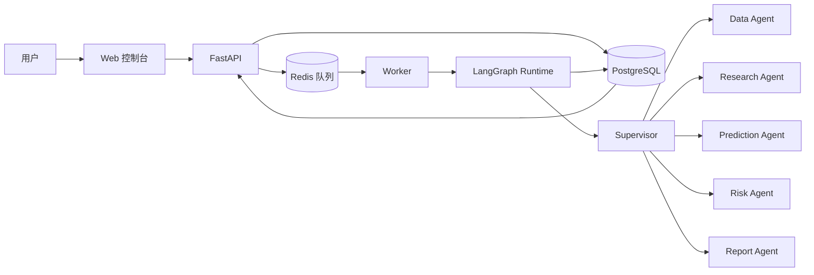

# FinAgent 金融多智能体平台

<p align="center">
  <strong>面向金融研究的可解释、可追踪多智能体平台。</strong>
</p>

<p align="center">
  <a href="./README.md">English</a> | <a href="./README.zh-CN.md">中文</a>
</p>

<p align="center">
  <a href="https://github.com/Ashleyzm/financial-agent-platform/actions/workflows/ci.yml"></a>
  
  
  
  
  
</p>

FinAgent 将一个股票研究问题转化为异步、可审计的多智能体工作流。Supervisor 负责任务调度，Data、Research、Prediction、Risk 和 Report Agent 分别完成数据、研究、预测、风险与报告工作。LLM 负责理解、整合和解释，结构化模型与工具负责数据和预测。

> [!IMPORTANT]
> 本项目仅用于研究与教学，所有输出均不构成投资建议。

## 项目亮点

- **全过程可解释**：展示 Agent 步骤、证据、模型用量、错误信息和 Trace ID。
- **Provider 可替换**：支持 Mock、AkShare 行情和 OpenAI-compatible LLM。
- **异步且可持久化**：FastAPI、Redis、Worker、LangGraph、PostgreSQL 已形成完整链路。
- **适合学生团队**：无需付费 API Key，也能通过 Docker Compose 稳定演示。
- **具备工程规范**：包含健康检查、数据库迁移、统一错误、CI 与公网服务器部署配置。

## 系统架构



```text
Web -> FastAPI -> PostgreSQL / Redis -> Worker -> LangGraph -> 预测研究报告
```

## 当前能力

| 模块 | 状态 | 说明 |
|---|---|---|
| 任务 API | 已完成 | 创建、列表、详情、取消与任务追踪 |
| 异步运行时 | 已完成 | Redis 队列与独立 Worker |
| 多智能体流程 | 已完成 | 六节点 LangGraph 与步骤持久化 |
| 行情数据 | 已完成 | Mock 与 AkShare 两种模式 |
| LLM 接入 | 已完成 | Mock 与 OpenAI-compatible 模式 |
| Web 控制台 | 已完成 | 创建任务、自动轮询、时间线、报告与失败状态 |
| 预测模型 | 原型 | 当前为规则基线，后续接入 ML/时间序列模型 |
| 新闻与财报 RAG | 规划中 | 检索、引用和来源管理 |

## 快速开始

### 环境要求

- Git
- Docker Desktop 与 Docker Compose
- 仅在本地运行测试时需要 Python 3.12+

### 启动完整平台

```powershell
Copy-Item .env.example .env
docker compose up -d --build --wait
```

打开：

- Web 控制台：<http://localhost:3000>
- API 健康检查：<http://localhost:8000/health>
- API 接口文档：<http://localhost:8000/docs>

在 Web 页面创建股票研究任务后，Worker 会自动消费任务，页面会持续更新直至报告生成。

开发环境的全部端口默认只绑定到 `127.0.0.1`，其他电脑无法直接访问。

停止平台：

```powershell
docker compose down
```

## Provider 配置

默认配置完全离线，不需要任何外部 Key：

```env
MARKET_DATA_PROVIDER=mock
LLM_PROVIDER=mock
```

需要真实行情时，将 `MARKET_DATA_PROVIDER` 设置为 `akshare`。需要接入兼容模型时，在 `.env` 中配置 `LLM_PROVIDER=openai-compatible`、`LLM_API_KEY`、`LLM_BASE_URL` 和 `LLM_MODEL`。

请勿提交 `.env` 或任何生产密钥。

## 公网部署

`localhost` 只能由当前电脑访问。要给同学、老师或面试官提供稳定链接，需要将完整平台部署到一台具有公网 IP 的 Linux 服务器：

```bash
cp .env.production.example .env.production
# 先替换所有 CHANGE_ME，再继续执行。
docker compose --env-file .env.production -f compose.prod.yaml up -d --build --wait
```

生产配置只向公网开放 Web 网关，PostgreSQL、Redis、API 和 Worker 都保留在 Docker 私有网络中。服务器、防火墙、域名、HTTPS 与安全配置请查看[公网部署指南](docs/public-deployment.zh-CN.md)。

## 项目结构

```text
apps/web/                   Web 控制台与 Nginx 网关
services/api/               FastAPI 应用
services/worker/            异步任务 Worker
packages/contracts/         公共 API 与工作流契约
packages/agent_runtime/     LangGraph 工作流与 Agent 工具
packages/model_provider/    LLM Provider 抽象
packages/financial_data/    金融数据 Provider
packages/task_store/        PostgreSQL 与 Redis 持久化
infra/                      数据库迁移与基础设施
tests/                      单元测试和端到端测试
docs/                       产品、架构与部署文档
```

## 开发检查

```powershell
python -m pip install -e ".[dev]"
ruff check .
ruff format --check .
pytest -q
python tests/e2e_smoke.py
```

每个 Pull Request 都会在 GitHub Actions 中完成代码质量检查，并从零启动 Docker 环境进行端到端测试。

## 后续路线

- ML/时间序列预测基线与回测
- 新闻、公告、年报与研报 RAG
- 证据引用与来源时效控制
- 登录鉴权、额度与团队工作空间
- 可观测性面板、评估数据集与模型成本控制

## 致谢

产品方向参考了开源项目 [TradingAgents](https://github.com/TauricResearch/TradingAgents) 与 [go-stock](https://github.com/ArvinLovegood/go-stock)。本仓库采用独立的平台架构与代码实现。

## 许可证

项目目前尚未声明开源许可证。在仓库添加 License 文件前，默认由仓库所有者保留全部权利。
